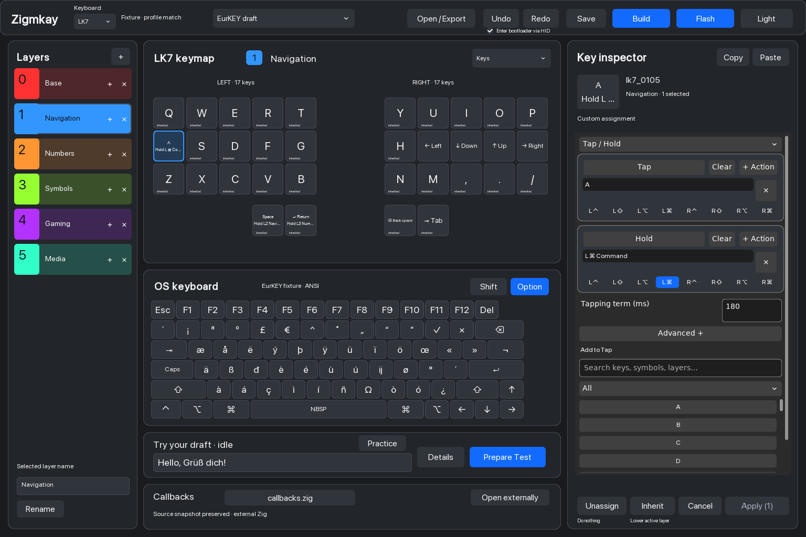
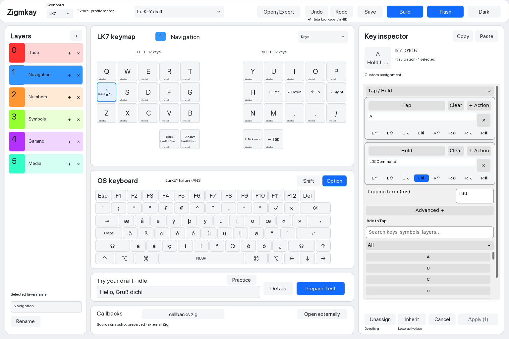
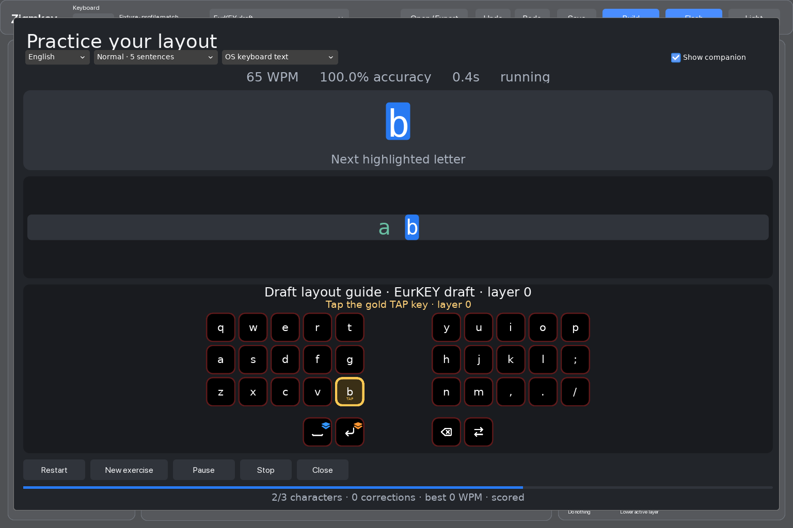

# zigmkay_firmware

A local Zig 0.16.0 keyboard firmware monorepo. **Mise is the terminal entry
point**: it pins Zig, discovers package tasks, completes arguments and schedules
repository-wide work. Packages own their Zig builds; root Zig owns integration
tests and the offline guard. No sibling clones or package directory changes are
needed.

The native editor supports named layers, staged Tap/Hold assignment editing,
component-preserving bulk edits, atomic project save/reopen, firmware builds,
and offline testing with the real keyboard processor. The version-1 project,
export and runner contract remains frozen at `016cf7d`. Follow the
[tracker](docs/plans/TRACKING.md) for current implementation and acceptance
evidence. Other platforms and boards retain separate acceptance gates.

## Native editor

Launch with `mise //zigmkay-companion:editor`. Select physical keys, edit their
Tap and Hold components in the docked inspector, and Apply once to commit an
undoable change. Cancel discards the staged edits. Unassign blocks fallback;
Inherit lets a lower active layer supply an action. Search, modifiers, timing,
one-shot settings and validation stay in the inspector.

These are captures of the running macOS DVUI/SDL application with an isolated
EurKEY project fixture, captured offline; they are not design mockups.



The same editing controls are available in light mode.



Typing practice combines exercise text, scoring and a keyboard preview.



## Setup and discovery

Use mise 2026.9.14 or newer. From this directory:

```sh
mise trust
mise install
mise tasks --all                    # descriptions for root and package tasks
mise tasks deps //:test              # inspect the aggregate test graph
mise //:firmware --help              # board and optimization choices
mise //:companion-run --help         # GUI options
mise //:ls                          # ten-board catalog
```

This is real mise monorepo mode: `//:task` selects a root task and
`//package:task` selects a package task, from anywhere inside the repo.
Use those names for reliable argument completion on the validated mise version.
For example, `mise //:firmware <TAB>` lists board IDs and
`mise //:companion-run --<TAB>` lists GUI options. Short commands such as
`mise run test` also execute, but unqualified argument completion is limited in
mise 2026.9.14.

Install completion once for your shell:

```sh
mise completion fish --install
# or:
mise completion zsh --install
```

Fish loads the installed completion automatically. Zsh prints its required
`fpath`/`compinit` setup; follow that output in your own shell configuration.
Task execution does not require shell activation. The root `mise.toml` pins
Zig to 0.16.0, matching `.zigversion`; it applies to package tasks too.

## Everyday tasks

```sh
mise //:test                         # each package test plus integration
mise //zigmkay:test                  # only processor tests
mise //zigmkay-companion:test        # only companion tests; no HID
mise //:check                        # tests/generated checks plus offline guard
mise //:check-full                   # full build matrix, replay and parity
mise //:workspace-check              # package/aggregate/catalog consistency
mise //:gui-acceptance               # native editor captures, interactions and goldens
mise //:firmware lk7                 # build only, no device access
mise //:firmware lk7 --optimize Debug
mise //:firmware-all
mise //:companion
mise //:companion-run --smoke
mise //:companion-run --replay tests/fixtures/lk7_trace.bin
mise //:companion-headless
mise //:replay tests/fixtures/lk7_trace.bin
mise //:flash-tool                   # build only
```

Artifacts stay in root `zig-out`: firmware in
`zig-out/firmware/<board>/zigmkay.uf2`, GUI at
`zig-out/bin/zigmkay_companion`, replay at
`zig-out/bin/zigmkay-companion-headless-lk7`, flasher at
`zig-out/bin/zig_flash`. Firmware defaults to ReleaseSafe; host tools remain
native. GUI/replay currently use the fixed LK7 Danish profile. GUI replay/capture
paths are relative to the monorepo root. Root `zig build` now runs integration
checks only; use `mise //:test` for the entire repository.

Root and package firmware/GUI interfaces share mise task templates. Board
choices are checked against `keyboards/boards.zon`; workspace checks also reject
undiscovered package configurations and omitted package test/generated-check
tasks. Add new packages explicitly to `config_roots` and the aggregate tasks.

Mise schedules two tasks by default (`MISE_JOBS` overrides it), while
`ZIGMKAY_BUILD_JOBS` controls compiler concurrency per command (default four).
The guard inherits those settings when it launches its nested scheduler; the
outer check command waits for that scheduler. Package caches remain local and
Zig's global cache shares compiler work. `check-full` covers the offline build
matrix; `gui-acceptance` additionally opens native windows for all editor
scenarios, semantic interactions, resizing and the approved golden comparisons.

## Explicit hardware tasks

Only use these during an authorized device session:

```sh
mise //:flash lk7                    # selected firmware build, then zig_flash
mise //:flash lk7 --mount /Volumes/RPI-RP2
mise //:flash-file .zig-cache/manual-session/rollback-ab66f12/zigmkay-rp2040.uf2
mise //:companion-run --live
mise //:companion-run --live --capture /tmp/lk7.capture --capture-ms 30000
mise //:companion-run --session-replay /tmp/lk7.capture   # offline
```

Flash requires an explicit board or UF2, waits for BOOTSEL, and uses the Zig
utility. Write/sync success does not independently verify installed identity or
automatic restart; that device issue remains under investigation in
[04](docs/plans/handovers/04-hardware.md). Live HID, flashing and generated source
updates are excluded from aggregate tests/checks. No default task accesses hardware.

`flash lk7` builds the identity verifier; other boards only build firmware and
the transfer tool. `flash-file` builds the verifier only with `--verify-lk7`.

## Packages

| Task namespace | Ownership |
| --- | --- |
| `//zigmkay` | Processor and firmware behavior |
| `//keyboards` | Board catalog and firmware builds |
| `//layout-model` | Portable key and physical types |
| `//device-protocol` | Telemetry codec |
| `//companion-model` | Portable session/state model |
| `//keymap-project` | Versioned project, source snapshots, validation and Zig generation (07A accepted) |
| `//companion-jobs` | Bounded processes, firmware artifact contracts and source traversal |
| `//zkeycodes` | Keycodes, HJSON conversion and generated checks |
| `//zkeymap` | Native keyboard translation; existing C bridges |
| `//zigmkay-companion` | DVUI/SDL3 GUI and component tests |
| `//zig-flash` | Zig UF2 utility and offline platform checks |
| `//apps/headless` | Offline trace replay |
| `//apps/keymap-test` | Native processor draft runner and acceptance fixtures |
| `//tools/registry` | Registry validation/check/regeneration |
| `//:integration-test` | Cross-package identity/session/trace checks |

Codec/session behavioral fixtures remain cross-package integration tests;
their package test steps also compile their own portable module roots.
First-party implementation, generators and validation remain Zig. External
dependencies use immutable revisions and hashes in package `build.zig.zon`
files. Push only to the fork's `origin` when requested; create pull requests
only when requested.

Regeneration is explicit:

```sh
mise //:check-generated              # compare only
mise //:registry-regenerate          # update committed registry
mise //:convert-all                  # update committed keycodes
mise //:convert input.hjson output.zig
```

See [development](docs/development.md), [mise migration](docs/plans/10-mise-monorepo.md),
[protocol](docs/device-protocol.md), [firmware telemetry](docs/firmware-telemetry.md),
and [overlay guide](docs/live-overlay.md).

The separate native LK7 draft editor is available through
`mise //zigmkay-companion:editor`. Follow the
[plan 07 self-verification guide](docs/plans/07-editor-verification.md) for
editing, atomic save/reopen, deterministic export and isolated draft testing.
`mise //zigmkay-companion:editor-golden-check` checks the user-approved dark/light
captures without refreshing them. Editing, exporting, building and checks remain
offline. The explicit **Flash** button waits for the RP2040 recovery drive and
optionally requests bootloader entry over HID. Disable **Enter bootloader via
HID** for manual BOOTSEL or keyboards without supporting firmware; missing HID
support also falls back to manual recovery. See the
[build/flash guide](docs/plans/08-editor-verification.md). Plan 12 remains deferred.
